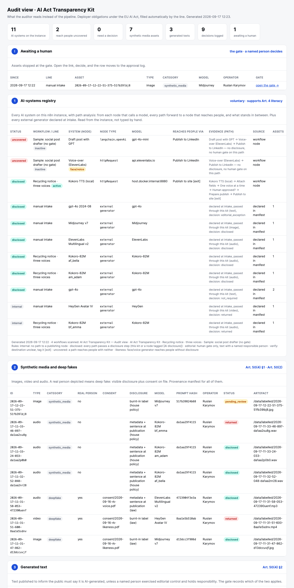
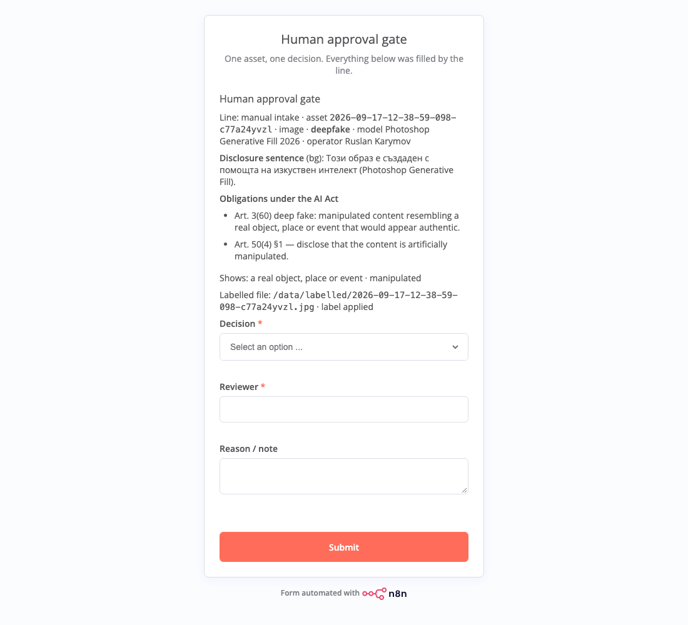

# AI Act Transparency Kit — an n8n module for the deployer side of Article 50

Importable n8n workflows that make EU AI Act transparency a property of the production line, not a report written before the audit.

- **AI Act Transparency Kit** — a module any line calls with *Execute Sub-workflow* (or its own intake form): classification under Article 50 → label (ffmpeg service) and provenance manifest → **human approval gate** (a form, or a Slack thread) → approval log → **AI-systems registry of the whole n8n instance with path analysis**: from every node that calls a model, every path forward to a node that reaches people, and what stands in between. Returns `approved`, `disclosure_status`, `labelled_path`, `disclosed_text` to the caller.
- **Audit view** — `GET /webhook/audit`: assets awaiting a human (with gate links), the registry, synthetic media, generated text, the approval log. Read from the Postgres ledger; the approval log is append-only and hash-chained, and the chain is verified on every render.
- **Recycling notice · three voices** — a real line with the kit as a module: text → Kokoro-82M (local TTS, three stock voices) → AI Act gate → publish only what a human approved.
- **Sample: social post drafter** — a marketing line without any gate, so the registry has something to flag.



## What it decides

| Input | Category | Duty (deployer) | What the kit does |
|---|---|---|---|
| image / video / audio showing **a real person, object, place or event** (generated or manipulated) | `deepfake` (Art. 3(60)) | Art. 50(4) §1: disclose that it is artificially generated or manipulated; limited form allowed for artistic, creative or satirical work | label burnt in with ffmpeg (“AI-generated” or “AI-manipulated”; small corner label when artistic), metadata, manifest; consent asked for people (GDPR, not the AI Act) |
| image / video / audio showing **nothing real** | `synthetic_media` | Art. 50(2) marking is the provider's duty | label by house policy on image and video, manifest |
| text, **published to inform the public** | `generated_public_text` | Art. 50(4) §2: disclose, unless a named person holds editorial responsibility | disclosure footer prepared; the gate can replace it with an *editorial exception* and records who signed |
| text, internal | `internal_text` | none | manifest only |

The disclosure sentence is **fixed wording per language** (en, bg, ru, de) chosen at intake, with the generating system's name inserted. It is legal text: approved once, in `build.py`, with counsel, never generated per asset. There is deliberately no model inside the kit.

Every asset stops at the gate. The reviewer sees the category, the obligations, the consent reference, the labelled file or the text as it would be published, and chooses **Approve**, **Editorial exception** (text only) or **Return** with a reason.



## Storage: a ledger, not files

Everything the auditor reads lives in Postgres (`db/schema.sql`): `assets` (one row per asset, the manifest as jsonb), `decisions` and `registry_snapshots`. Two rules are enforced by the database itself, not by the workflow:

- **`decisions` is append-only.** A trigger refuses `UPDATE` and `DELETE`, even from the owner role.
- **Every decision is hash-chained.** A `BEFORE INSERT` trigger computes `hash = sha256(prev_hash | asset | time | reviewer | decision | reason | status | responsible | artefact)`, so the application never chooses its own hash. `verify_chain()` recomputes the whole chain; the audit view runs it on every render and prints *chain verified* or the first broken row.
- The registry is stored as a snapshot per run: history, not a file that gets overwritten.

Only media files (incoming and labelled) stay on disk under `data/`.

## The gate: form or a Slack thread

`GATE_MODE` in `.env` (read by `build.py`, default `form`):

- `form` (default) — a Wait node with a form. Works anywhere; the link is on the audit view and, if a Slack credential is attached, posted to `#ai-act-gate` by **Notify reviewer**. Reviewer identity is whatever the person types.
- `slack` — the kit posts the asset to a thread in `#ai-act-gate` and then **polls the thread** every 20 s (Slack → channel → replies) until a channel member answers `approve`, `editorial` or `return <reason>`. All traffic is outbound: n8n needs no public address, only a bot token with `chat:write`, `channels:read`, `channels:history`, `users:read`, and `files:write` if you want the labelled file attached to the thread (without that scope the upload is skipped and the thread carries the file path). Text assets are quoted in the post, so the reviewer decides without leaving Slack. The reviewer's identity comes from Slack (`users.info`), not from a text field, which answers the auditor's first question. After 24 h without an answer the asset is returned automatically. Verified end to end on 17 Sep 2026: a reply `approve` in the thread landed in the ledger as `Ruslan (Slack U…)`.

## Labels without a shell

The kit has no Execute Command node. Files go to a small **media-label service** (`tools/media-label`, Python + a static ffmpeg with drawtext, its own container on the same Docker network): images and video get the burnt-in label (full, or a small corner label for artistic work), audio gets the label in its metadata. If the service is unreachable, images fall back to the built-in **Edit Image** node (plain text, works on n8n Cloud), video and audio get *no burnt-in label* and the manifest and audit view say so: the disclosure then goes with the file at publication. Publishing in the demo line is two Read/Write Files nodes.

## Embedding the kit in a line

```
… generator → Loop Over Items (batch 1) → [Execute Sub-workflow: AI Act gate] → back to the loop
                                    └─ done → IF approved → publish [exit]
```

One item per call: the sub-workflow stops at its Wait-form gate, the parent waits, and the loop's *done* output collects every decision. (The "run once for each item" mode of Execute Sub-workflow returns a single item when the sub-workflow waits, and n8n has deprecated it.) The path analysis knows loop semantics: whatever leaves the loop's *done* output has passed through the loop body.

Pass with each item: `asset_type`, `language`, `model`, `model_version`, `prompt`, `operator`, `depicts_real_person`, `consent_reference`, `public_information`, `caller_workflow`, and the file as binary `data`. The parent execution waits while the human decides; the gate link is on the audit view under **awaiting a human**. Two naming conventions let the registry read lines it did not build: tag your own publishing nodes `[exit]` and your own disclosure or labelling nodes `[AI disclosure]`.

## Path analysis — how the registry judges a line

The Act does not regulate links between nodes; it regulates what reaches people. So for every node that calls a model the registry walks **every** path forward to every node that reaches people (social, mail, messaging, CMS types, or `[exit]`) and records what stood in between.

| Status | Rule | Meaning for the auditor |
|---|---|---|
| `internal` | no path reaches a publishing node | no Art. 50 duty, recorded anyway |
| `disclosed` | every path passes a disclosure step (this kit, or a node tagged `[AI disclosure]`) | disclosure is built into the line |
| `editorial` | no disclosure step, but every path passes a human gate | allowed for text only, Art. 50(4) §2, with a named responsible person |
| `verify` | a destination that may or may not reach people (unknown HTTP host, Slack, Notion, Sheets) | a person decides; tag the node `[exit]` or leave it |
| `uncovered` | a path reaches people with neither | AI content goes out without disclosure and without a responsible person |
| `likeness` | a face or voice generator (ElevenLabs, HeyGen, D-ID, Synthesia, voice clones) reaches people without a disclosure step, even through a gate | deep fakes need disclosure regardless, Art. 50(4) §1 |
| `inform` | an emotion-recognition or biometric-categorisation system runs on people and no node in the workflow is tagged `[persons informed]` | the exposed people must be informed, Art. 50(3), publishing or not |
| `chatbot` | a system interacts with people (chat trigger, agent) and no node is tagged `[ai disclosed]` | people must be told they talk to an AI unless obvious, Art. 50(1) |
| `informed` | one of the two above with the tag present | duty covered |

Each row carries its evidence: the chain of nodes, e.g. `Draft post with GPT → Voice-over (ElevenLabs) → Publish to LinkedIn — no disclosure, no human gate on this path`. What the graph cannot know stays a human declaration: whether a real person is depicted, whether a text informs the public, whether a Slack channel is internal.

## The blocks an auditor reads

| # | Block | Article | Filled from |
|---|---|---|---|
| 0 | Awaiting a human | Art. 14, the gate | inbox files: one per asset stopped at the gate, with the gate link |
| 1 | AI-systems registry | Art. 4, deployer duties | **every workflow on the instance** (n8n API): every node that calls a model, with path analysis (see above) — **plus** every model declared in a manifest, since generation often happens outside n8n |
| 2 | Synthetic media and deep fakes | Art. 50(4) §1, 50(2) | manifests: label, consent, model, prompt hash, operator, status |
| 3 | Generated text | Art. 50(4) §2 | manifests: disclosed or editorial exception, responsible person |
| 4 | Approval log | Art. 14; Art. 12 (mandatory only for high-risk, kept voluntarily) | one record per decision: who, what, when, why, artefact, execution id |

Three inactive sample lines exist so the registry has something to judge: `sample-line.json` (GPT drafts a post, ElevenLabs voices it, LinkedIn publishes: both generators `uncovered`), `sample-50-3.json` (a support inbox scored for customer emotion, nothing published: `inform`), `sample-chatbot.json` (a bot that answers as “Anna from support”: `chatbot`).

Scope is deliberate: deployer duties under Article 50 (in force 2 August 2026) and Article 4. High-risk obligations (Annex III) are out of scope and not claimed.

## Quick start (ten minutes, one machine)

Needs Docker. No model, no GPU, no API key: the kit labels and records what *your* generators produce.

**Option A · Docker Compose, one command**

```bash
git clone https://github.com/karusrus/transparency-kit && cd transparency-kit
docker compose up -d                          # Postgres + label service + stock n8n; the init job imports and publishes the six workflows before n8n starts
open http://localhost:5678                    # create the n8n owner account (once)
open http://localhost:5678/form/ai-act-intake # send the first asset through the gate
open http://localhost:5678/webhook/audit      # the auditor's page, filled from the ledger
```

`docker compose down -v` removes everything. Set `KIT_DB_PASSWORD` in `.env` for anything beyond a laptop demo.

**Option B · the scripts (needs Python 3; what this repository was built with)**

```bash
git clone https://github.com/karusrus/transparency-kit && cd transparency-kit
./reload.sh        # same three containers with plain docker run; generates the DB password into .env, imports and publishes
./update.sh        # after editing workflows/build.py: rebuild, re-import, publish; keeps owner, API key, credentials and the ledger
./demo.sh          # seven assets and seven decisions through the intake form, for numbers on the audit view
```

That is the whole install for the default **form gate**: every asset waits at a form, the link sits on the audit view. Two optional steps unlock the rest:

| Optional | Why | How |
|---|---|---|
| **AI-systems registry** | reads every workflow on the instance | *Settings → n8n API* → create a key (scope `workflow:list`), add an *n8n API* credential (base URL `http://localhost:5678/api/v1`), attach it to the node **Read all workflows**, publish |
| **Slack gate** | reviewers answer in a thread, identity from Slack | a Slack app with `chat:write`, `channels:read`, `channels:history`, `users:read`, `files:write`; a *Slack API* credential in n8n; `GATE_MODE=slack` in `.env`, then `./update.sh` (Option B; with Compose: `GATE_MODE=slack python3 workflows/build.py && docker compose run --rm init && docker compose restart n8n`) |
| **Demo line with voices** | the three-voices example needs a local TTS | `python tools/kokoro_server.py --port 8880` (kokoro-onnx, CPU) |

Which models does it work with? Any. The line passes the generator's name (`model`, `model_version`) and the prompt; the kit hashes the prompt, fixes the disclosure sentence and never calls a model itself. The only model in this repository is the demo voice.

`reload.sh` (Option B) deletes both volumes: the n8n owner account, API key and credentials, and the ledger. Use `update.sh` for everything after the first run (it re-imports the workflows and keeps everything else). The database password is generated into `.env` and `secrets/postgres-credential.json` on first run (both git-ignored); the credential id `KitPostgresCred01` is fixed so the imported workflows bind to it.

Environment the kit needs (already in `reload.sh`):

| Variable | Why |
|---|---|
| `N8N_RESTRICT_FILE_ACCESS_TO=/data` | the Read/Write File node may only touch the mounted media folder |
| `N8N_RUNNERS_ENABLED=true` | Code nodes run in the task runner |

## Files

```
workflows/build.py           generator: edit here, then python3 workflows/build.py
workflows/transparency-kit.json
workflows/audit-view.json
workflows/host-line.json     the three-voices line with the kit as a module
workflows/sample-line.json   a marketing line without a gate, for the registry to flag
tools/kokoro_server.py       HTTP wrapper around Kokoro-82M for n8n (demo line)
tools/media-label/           the label service: Dockerfile + server.py
workflows/audit_render.js    the auditor's page (inlined into the Code node)
db/schema.sql                assets · decisions (append-only, hash-chained) · registry_snapshots · verify_chain()
data/                        incoming/  labelled/  published/  (media only; the ledger is in Postgres)
samples/                     synthetic test assets (ffmpeg testsrc), no people, no rights
docs/                        screenshots and a static copy of the audit view
reload.sh · update.sh · demo.sh
```

Manifest example:

```json
{
  "id": "2026-09-16-18-00-10-8aa1e5b5",
  "asset_type": "video",
  "category": "deepfake",
  "label_required": true,
  "label_basis": "law",
  "obligations": ["Art. 50(4) §1 — …", "Consent of the depicted person must be on file …"],
  "model": "HeyGen", "model_version": "Avatar IV",
  "prompt_sha256": "8aa1e5b5…",
  "operator": "Ruslan Karymov",
  "depicts_real_person": true, "consent_reference": "consent/2026-09-16-rk-likeness.pdf",
  "labelled_path": "/data/labelled/2026-09-16-18-00-10-8aa1e5b5.mp4",
  "language": "bg", "disclosure_sentence": "Този видеоклип е създаден с помощта на изкуствен интелект (HeyGen).",
  "status": "returned", "disclosure_status": "returned", "reviewer": "Ruslan Karymov"
}
```

## Swap points

The kit is built so that each part can be replaced without touching the rest:

- **Gate** — the Wait-form gate can be replaced by Gmail, Slack or Telegram *Send and Wait*; the registry recognises both.
- **Storage** — the three Postgres nodes can point at any Postgres (managed or on-prem); the schema is one file.
- **Label** — the media-label service can be replaced by Bannerbear or any HTTP labeller; Edit Image is the built-in fallback for images.
- **Intake** — the form can be replaced by a webhook from the generation pipeline; field names stay the same.

## Not legal advice

This is an engineering artefact that shows how deployer duties can be implemented in a production line. Whether a given asset falls under Article 50, and how the disclosure must look in a given context, is a decision for the organisation and its counsel.
